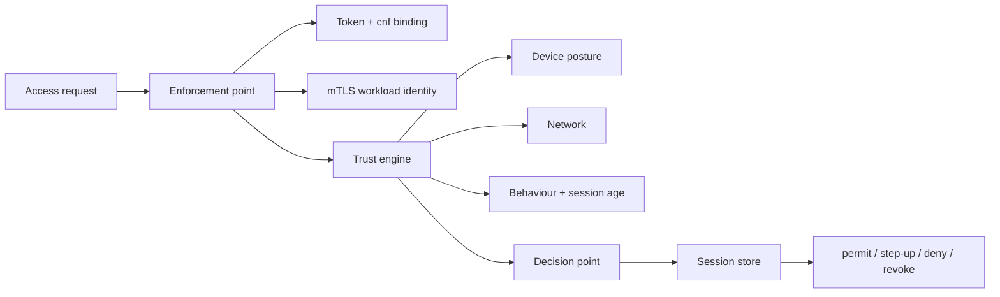

# Zero Trust Mesh

**Continuous verification, not a login. Every request is re-authenticated,
re-scored, and re-authorized against live signals — so access can be revoked
mid-session the moment a device, token, or location changes.**

[](https://github.com/Vincent-P-essy/zero-trust-mesh/actions/workflows/ci.yml)
[](pyproject.toml)
[](LICENSE)

Zero Trust Mesh is a working implementation of a Zero Trust access architecture,
not an article about one. It wires together an OIDC-style identity provider, a
SPIFFE workload certificate authority for mTLS identity, a deterministic trust
engine, a deny-override policy decision point, and a session store that turns a
point-in-time login into continuous verification. The whole path runs on **every
request**, which is the property that lets the mesh withdraw access in the middle
of a session rather than waiting for a token to expire.

The engine is deterministic: identical inputs always yield an identical decision,
and every decision carries the trust factors and policy rule that justified it.
It is a portfolio-grade prototype over synthetic data, not a replacement for a
production identity provider, service mesh, or policy platform.

## Measured evidence

| Measurement | Reviewed result | Scope |
|---|---:|---|
| Continuous-verification scenarios reproduced | **9/9 (100%)** | Declared step effects and final session state |
| Ground truth verified against committed fixture | **Yes** | `scenarios.py` vs `fixtures/ground-truth.json` |
| Determinism across 200 passes | **1 identical outcome hash** | 13 decisions per pass, hash excludes timing |
| Decision latency p50 / p95 | **37.7 / 47.8 ms** | Full 13-step pass, local, includes RSA in one scenario |
| Per-request mean latency | **~3.0 ms** | Authenticate → trust → policy → session |
| Test coverage | **97.40%** | Branch-aware source coverage |

Latency covers authentication (including RSA token and certificate operations in
the token-revocation scenario), trust scoring, policy decision, and session-state
updates; it excludes HTTP and the dashboard. See the
[methodology](docs/METHODOLOGY.md) and [reviewed reference run](benchmarks/reference/README.md).

## What is implemented

- **Identity provider** (`identity.py`): RS256 JWTs, a JWKS document with key
  rotation, RFC 7662-style introspection, a `jti` revocation list, and RFC
  8705-style `cnf` proof-of-possession binding a token to a workload certificate.
- **Workload CA** (`ca.py`): issues and verifies short-lived X.509 leaf
  certificates whose only identifier is a SPIFFE URI SAN — the identity half of
  mutual TLS, checked against the trust domain.
- **Enforcement point** (`pep.py`): a sidecar that verifies the certificate, the
  token, and their binding *before* any policy runs, and fails closed on any gap.
- **Trust engine** (`trust.py`, `device.py`): a deterministic 0-100 score
  blending authentication assurance, attested device posture, network reputation,
  and behavioural signals (session decay, impossible travel, new device), with a
  documented factor for every point.
- **Policy decision point** (`pdp.py`): deny-override evaluation with a default
  deny, a most-specific-allow rule order, trust floors, assurance/device/network
  conditions, and a distinct **step-up** outcome carrying an obligation.
- **Continuous verification** (`session.py`, `mesh.py`): a session lifecycle in
  which trust is recomputed every request; a session that collapses or whose
  token is revoked becomes `revoked` and stays revoked until re-authentication.
- CLI, local API, dependency-free dashboard, JSON/Markdown/DOT reports, Docker,
  CI, tests, and a reproducible benchmark. The wheel embeds its fixtures,
  dashboard, and dependency lock, so default commands work outside a checkout.

## Why "continuous" is the whole point

A conventional gateway authenticates once and caches an allow for the life of the
session. This mesh recomputes trust and re-runs policy on every call, so a signal
change takes effect immediately:

- **`posture-drop-revoke`** — a device permitted at `t+0s` stops attesting at
  `t+600s`; the stale attestation fails closed, the session is revoked, and a
  later healthy request at `t+1200s` is still denied.
- **`token-revoked-mid-session`** — a bound token permitted on the first call is
  revoked; the very next call is denied because revocation is checked every time.
- **`impossible-travel-deny`** — a session that jumps `FR → RU` in minutes loses
  the trust needed for the payments ledger.

Removing the per-request re-evaluation would break all three. That is the
difference between "Zero Trust" as a slogan and as an architecture.

## Architecture



Every arrow is traversed on every request. See [docs/ARCHITECTURE.md](docs/ARCHITECTURE.md).

## Quick start

Requirements: Python 3.11 or 3.12 and [`uv`](https://docs.astral.sh/uv/).

```bash
uv sync --frozen --all-extras

# Evaluate a single request
uv run ztmesh authorize --principal alice --device laptop-alice \
  --resource payments-db --corporate --assurance aal2

# Replay a continuous-verification scenario
uv run ztmesh scenario posture-drop-revoke

# Run the full suite and measure it
uv run ztmesh scenario all
uv run ztmesh benchmark --iterations 200
```

Start the API and dashboard:

```bash
uv run ztmesh serve --host 127.0.0.1 --port 8080
```

Open <http://127.0.0.1:8080>. The dashboard runs scenarios and shows each
session's verification timeline, and lets you compose a request and inspect the
trust factors behind the decision. OpenAPI is at `/docs`.

## Trust and policy semantics

Trust is a fixed weighted blend of identity (0.35), device (0.40), and network
(0.25), reduced by behavioural penalties, with a documented factor per point —
see [docs/TRUST_MODEL.md](docs/TRUST_MODEL.md). Policy is deny-override over a
default deny, with a most-specific-allow order and step-up bands — see
[docs/POLICY_MODEL.md](docs/POLICY_MODEL.md). Authentication fails closed on an
unresolved subject, stale attestation, invalid or revoked token, or broken
certificate binding.

## Important limitations

- Synthetic environment: device posture and network reputation are declared, not
  observed from a real MDM or threat feed.
- The identity provider and CA are minimal demonstrations with test-sized keys;
  the CA proves workload identity but does not perform TLS or encrypt transport.
- Trust weights are illustrative, not calibrated; the score is a comparison
  heuristic, **not** a breach probability or compliance grade.
- The local API is unauthenticated and must be bound to loopback.

See [architecture](docs/ARCHITECTURE.md), [threat model](docs/THREAT_MODEL.md),
and [limitations](docs/LIMITATIONS.md) before interpreting a result.
