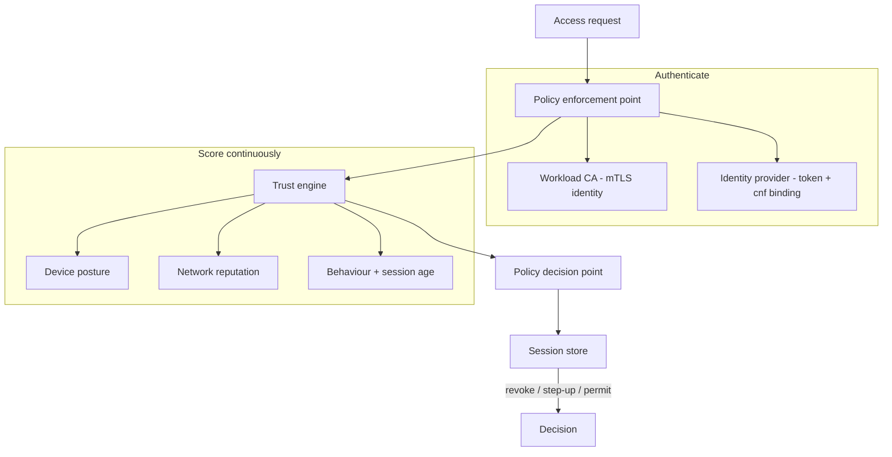

# Architecture

The mesh is a composition of small, single-purpose components. Each request
walks the same path, and the path runs in full on every request, which is what
makes verification continuous rather than point-in-time.

## Components

| Module | Responsibility |
|---|---|
| `identity.py` | OIDC-style provider: RS256 JWTs, JWKS, rotation, introspection, revocation, `cnf` binding |
| `ca.py` | Workload CA: issues and verifies short-lived SPIFFE X.509 identities (mTLS identity) |
| `pep.py` | Enforcement point: verifies certificate, token, and their binding before policy runs |
| `device.py` | Deterministic device-posture scoring with per-signal evidence |
| `trust.py` | Blends identity, device, network, and behaviour into a 0-100 trust score |
| `policy.py` / `pdp.py` | Policy model, selector matching, and the deny-override decision point |
| `session.py` | Session lifecycle and the continuous-verification state machine |
| `mesh.py` | Composition root; runs the full path in `MeshController.evaluate` |

## Why the whole path runs every time

A common shortcut is to authenticate once and cache an allow decision for the
life of a session. The mesh does the opposite: it recomputes trust and re-runs
policy on each request. That is the only way a session can lose access the
moment a signal changes — a device stops attesting, a token is revoked, the
origin jumps countries — without waiting for the session to expire. The
`posture-drop-revoke` and `token-revoked-mid-session` scenarios exist to
demonstrate exactly this.

## Determinism

There is no language model, randomness, or wall-clock dependence in the decision
path. Trust scoring is a fixed weighted function; policy evaluation is
deny-override with a documented specificity order. Session age is derived from
the request's own timeline (`at_epoch`), not the host clock. As a result the
benchmark reproduces one stable outcome hash across every pass.
